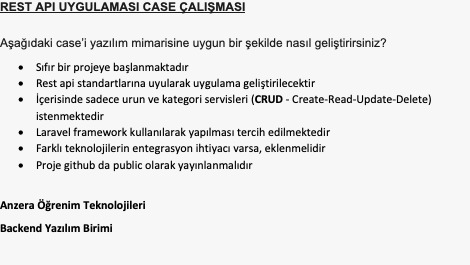

# Anzera Challenge with Laravel

## Challenge details



## What did I do?

- Created models: User, Category, Product. Relation definitions:
    - User -> Product: One to Many
    - Product -> User: Many to One
    - Category -> Product: One to Many
    - Product -> Category: Many to One
- Create foreign keys between products-users and products-categories tables in migration.
- Defined **CRUD REST** route with extending `Illuminate\Routing\Router` class. The class is here: `App\Extended\Router`. This is added to here: `bootstrap/app.php` file.
  Detailed info is [here](#router).
- Example middleware: App\Http\Middleware\PrintJsonResponse
- Sessions disabled from `App\Http\Kernel`.

## <a name="router"></a> REST CRUD router

Example usage:
<br />
`Route::restCrud('products', \App\Http\Controllers\Products::class);`

This is creating these routes:

```
HTTP      URL                    CLASS METHOD     ROUTE NAME
------------------------------------------------------------------
GET       /products              index            products.index
POST      /products/create       create           products.create
GET       /products/{id}         read             products.read
PUT       /products/{id}         update           products.update
DELETE    /products/{id}         delete           products.delete

```

You can look to `App\Extended\Router::restCrud()` method for implementation.

**Important thing about `PUT` (update) method:** You must make **HTTP POST** request and you must add `_method=PUT` parameter to form parameters. Otherwise Laravel can't
recognize the `PUT` method and routes blowing up.

## What about authentication?

Challenge rules didn't required any authentication. But I just added and configured Passport library to project. We can use it if we need. In first we must write an
Authentication controller for login-logout operations.

## Bugs and TODOs

All of these must be solve:

- Showing 404 if a request not validated. I must investigate this.
    - I investigated. `findOrFail()` method is causing this. If we don't find requested id from table then Laravel is opening 404 page. In API response I must catch this
      and print as JSON.


